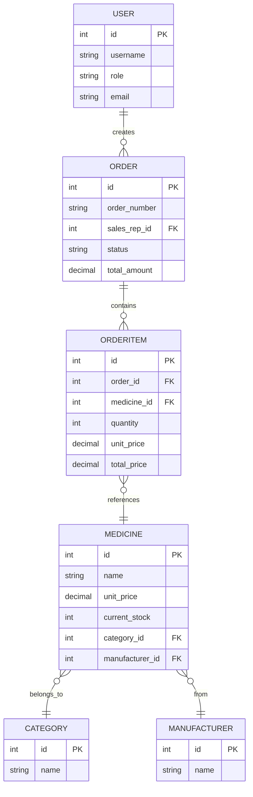

# Database Schema - Level 0 (Visual Diagram)

## Entity Relationship Diagram

### Text-Based ERD

```
                    ┌─────────────────┐
                    │      USER       │
                    │─────────────────│
                    │ PK: id          │
                    │     username    │
                    │     role        │
                    │     email       │
                    └────────┬────────┘
                             │
                             │ 1
                             │
                             │ creates
                             │
                             │ N
                             ▼
                    ┌─────────────────┐
                    │     ORDER       │
                    │─────────────────│
                    │ PK: id          │
                    │ FK: sales_rep_id│
                    │     order_number│
                    │     status      │
                    │     total_amount│
                    └────────┬────────┘
                             │
                             │ 1
                             │
                             │ contains
                             │
                             │ N
                             ▼
        ┌──────────────────────────────────────┐
        │          ORDERITEM                   │
        │──────────────────────────────────────│
        │ PK: id                               │
        │ FK: order_id      ────────────────┐  │
        │ FK: medicine_id   ───────────────┐│  │
        │     quantity                     ││  │
        │     unit_price                   ││  │
        │     total_price                  ││  │
        └──────────────────────────────────││──┘
                                           ││
                                           ││ N
                                           ││
                                           ││ references
                                           ││
                                           ││ 1
                                           │▼
        ┌──────────────────────────────────┐
        │          MEDICINE                │
        │──────────────────────────────────│
        │ PK: id                           │
        │     name                         │
        │     unit_price                   │
        │     current_stock                │
        │ FK: category_id ───────────────┐ │
        │ FK: manufacturer_id ──────────┐│ │
        └───────────────────────────────││─┘
                                        ││
                                        ││ N
                                        ││
                            ┌───────────┴┴──────────┐
                            │                       │
                            │ N                     │ N
                            │                       │
                            ▼                       ▼
                ┌──────────────────┐    ┌──────────────────┐
                │    CATEGORY      │    │  MANUFACTURER    │
                │──────────────────│    │──────────────────│
                │ PK: id           │    │ PK: id           │
                │     name         │    │     name         │
                └──────────────────┘    └──────────────────┘
```

---

## Mermaid Diagram Format



---

## Simple Table Structure

### USER
```
┌──────────┬──────────────┬─────────────┐
│    id    │  username    │    role     │
├──────────┼──────────────┼─────────────┤
│    1     │  john_doe    │  sales_rep  │
│    2     │  jane_smith  │ pharmacist  │
└──────────┴──────────────┴─────────────┘
```

### ORDER
```
┌────┬──────────────┬───────────────┬────────────┬──────────────┐
│ id │ order_number │ sales_rep_id  │   status   │ total_amount │
├────┼──────────────┼───────────────┼────────────┼──────────────┤
│ 1  │  ORD-001     │      1        │  pending   │   150.00     │
│ 2  │  ORD-002     │      1        │  confirmed │    75.50     │
└────┴──────────────┴───────────────┴────────────┴──────────────┘
```

### ORDERITEM
```
┌────┬──────────┬─────────────┬──────────┬────────────┬─────────────┐
│ id │ order_id │ medicine_id │ quantity │ unit_price │ total_price │
├────┼──────────┼─────────────┼──────────┼────────────┼─────────────┤
│ 1  │    1     │      5      │    2     │   50.00    │   100.00    │
│ 2  │    1     │      8      │    1     │   50.00    │    50.00    │
└────┴──────────┴─────────────┴──────────┴────────────┴─────────────┘
```

### MEDICINE
```
┌────┬──────────────┬──────────────┬───────────────┬──────────────┬─────────────────┐
│ id │     name     │  unit_price  │ current_stock │ category_id  │ manufacturer_id │
├────┼──────────────┼──────────────┼───────────────┼──────────────┼─────────────────┤
│ 5  │  Paracetamol │    50.00     │     100       │      2       │        1        │
│ 8  │   Metformin  │    50.00     │      50       │      1       │        2        │
└────┴──────────────┴──────────────┴───────────────┴──────────────┴─────────────────┘
```

### CATEGORY
```
┌────┬──────────────┐
│ id │     name     │
├────┼──────────────┤
│ 1  │  Diabetes    │
│ 2  │   Pain       │
└────┴──────────────┘
```

### MANUFACTURER
```
┌────┬──────────────┐
│ id │     name     │
├────┼──────────────┤
│ 1  │   Company A  │
│ 2  │   Company B  │
└────┴──────────────┘
```

---

## Relationship Cardinality

| Relationship | Type | Description |
|--------------|------|-------------|
| User → Order | 1:N | One user creates many orders |
| Order → OrderItem | 1:N | One order has many items |
| OrderItem → Medicine | N:1 | Many items reference one medicine |
| Medicine → Category | N:1 | Many medicines in one category |
| Medicine → Manufacturer | N:1 | Many medicines from one manufacturer |

---

## Key Concepts

1. **User** creates **Orders**
2. **Orders** contain multiple **OrderItems**
3. **OrderItems** reference **Medicines**
4. **Medicines** are organized by **Category** and sourced from **Manufacturer**

This Level 0 diagram shows only the essential business flow: **Users order Medicines**.

