# Data Flow Diagram (DFD)
## OnCare Medicine Ordering System

**Description**: This document provides comprehensive data flow diagrams (DFD) for the OnCare Medicine Ordering System, showing how data moves through the system from external entities through various processes to data stores and back to users.

---

## DFD Level 0: Context Diagram

The context diagram shows the system as a single process with all external entities and their interactions.

```
┌─────────────────────────────────────────────────────────────────────────┐
│                                                                         │
│                    ONCARE MEDICINE ORDERING SYSTEM                      │
│                                                                         │
└─────────────────────────────────────────────────────────────────────────┘
         │                    │                    │                    │
         │                    │                    │                    │
    ┌────▼────┐          ┌────▼────┐          ┌────▼────┐          ┌────▼────┐
    │  Sales  │          │Pharmacist│          │  System  │          │External │
    │   Rep   │          │  /Admin  │          │  Admin   │          │Payment  │
    │         │          │         │          │          │          │Gateway  │
    └────┬────┘          └────┬────┘          └────┬────┘          └────┬────┘
         │                    │                    │                    │
         │                    │                    │                    │
         └────────────────────┴────────────────────┴────────────────────┘
```

### External Entities

1. **Sales Representative**
   - Inputs: Order requests, payment information, prescription uploads, cart operations
   - Outputs: Order confirmations, order status updates, notifications, medicine catalog

2. **Pharmacist/Admin**
   - Inputs: Order status updates, payment verifications, inventory updates, prescription verifications
   - Outputs: Order details, inventory reports, payment submissions, reorder alerts

3. **System Administrator**
   - Inputs: User management, system configuration, audit log queries
   - Outputs: System reports, audit logs, user management confirmations

4. **External Payment Gateway**
   - Inputs: Payment processing requests
   - Outputs: Payment confirmations, transaction status

---

## DFD Level 1: Major Processes

The Level 1 DFD decomposes the system into major functional processes.

```
┌──────────────────────────────────────────────────────────────────────────────┐
│                         ONCARE MEDICINE ORDERING SYSTEM                        │
└──────────────────────────────────────────────────────────────────────────────┘
         │                    │                    │                    │
         │                    │                    │                    │
    ┌────▼────┐          ┌────▼────┐          ┌────▼────┐          ┌────▼────┐
    │  Sales  │          │Pharmacist│          │  System  │          │External │
    │   Rep   │          │  /Admin  │          │  Admin   │          │Payment  │
    │         │          │         │          │          │          │Gateway  │
    └────┬────┘          └────┬────┘          └────┬────┘          └────┬────┘
         │                    │                    │                    │
         │                    │                    │                    │
    ┌────▼────────────────────▼────────────────────▼────────────────────▼────┐
    │                                                                        │
    │  ┌──────────────┐  ┌──────────────┐  ┌──────────────┐  ┌────────────┐ │
    │  │  1.0 User    │  │  2.0 Order   │  │  3.0 Payment │  │  4.0       │ │
    │  │  Management  │  │  Processing  │  │  Processing  │  │  Inventory │ │
    │  │              │  │              │  │              │  │  Management│ │
    │  └──────┬───────┘  └──────┬───────┘  └──────┬───────┘  └──────┬─────┘ │
    │         │                 │                 │                 │       │
    │         │                 │                 │                 │       │
    │  ┌──────▼─────────────────▼─────────────────▼─────────────────▼─────┐ │
    │  │                                                                   │ │
    │  │  ┌──────────────┐  ┌──────────────┐  ┌──────────────┐           │ │
    │  │  │  5.0         │  │  6.0         │  │  7.0         │           │ │
    │  │  │  Prescription│  │  Notification│  │  Analytics & │           │ │
    │  │  │  Management  │  │  System      │  │  Forecasting │           │ │
    │  │  └──────────────┘  └──────────────┘  └──────────────┘           │ │
    │  │                                                                   │ │
    │  └───────────────────────────────────────────────────────────────────┘ │
    │                                                                        │
    └────────────────────────────────────────────────────────────────────────┘
         │                    │                    │                    │
         │                    │                    │                    │
    ┌────▼────┐          ┌────▼────┐          ┌────▼────┐          ┌────▼────┐
    │  User   │          │  Order   │          │ Payment │          │Medicine │
    │  Data   │          │   Data   │          │  Data   │          │  Data   │
    │  Store  │          │  Store   │          │  Store  │          │  Store  │
    └─────────┘          └──────────┘          └─────────┘          └─────────┘
```

---

## Detailed Process Decomposition

### Process 1.0: User Management

**Purpose**: Handle user authentication, authorization, and profile management

**Inputs**:
- Login credentials (from Sales Rep, Pharmacist/Admin, System Admin)
- User registration data
- Profile update requests
- Password reset requests

**Processes**:
- 1.1 Authenticate User
- 1.2 Register New User
- 1.3 Manage User Profile
- 1.4 Manage User Roles
- 1.5 Track User Sessions

**Outputs**:
- Authentication status
- User profile data
- Session information
- Role-based permissions

**Data Stores**:
- User Database (D1)
- User Session Database (D2)

**Data Flows**:
```
Sales Rep/Pharmacist/Admin/System Admin
    │
    ├─→ Login Credentials ──────────────┐
    │                                   │
    ├─→ Registration Data ──────────────┤
    │                                   ├─→ 1.0 User Management
    ├─→ Profile Updates ───────────────┤
    │                                   │
    └─→ Password Reset ─────────────────┘
                                        │
                                        ├─→ D1: User Database
                                        │
                                        └─→ Authentication Status
                                           User Profile
                                           Session Info
```

---

### Process 2.0: Order Processing

**Purpose**: Manage order creation, viewing, status updates, and fulfillment

**Inputs**:
- Cart items (from Sales Rep)
- Customer information
- Order status updates (from Pharmacist/Admin)
- Order queries

**Processes**:
- 2.1 Manage Shopping Cart
- 2.2 Create Order
- 2.3 View Orders
- 2.4 Update Order Status
- 2.5 Track Order History

**Outputs**:
- Order confirmations
- Order details
- Order status updates
- Order history

**Data Stores**:
- Cart Database (D3)
- Order Database (D4)
- Order Status History Database (D5)

**Data Flows**:
```
Sales Rep
    │
    ├─→ Cart Items ────────────────────┐
    │                                  │
    ├─→ Customer Info ───────────────┤
    │                                  │
    └─→ Order Queries ────────────────┤
                                       │
                                       ├─→ 2.0 Order Processing
                                       │
Pharmacist/Admin                      │
    │                                  │
    ├─→ Status Updates ───────────────┤
    │                                  │
    └─→ Order Queries ────────────────┘
                                       │
                                       ├─→ D3: Cart Database
                                       ├─→ D4: Order Database
                                       ├─→ D5: Order Status History
                                       │
                                       └─→ Order Confirmations
                                          Order Details
                                          Status Updates
```

---

### Process 3.0: Payment Processing

**Purpose**: Handle payment submissions, verifications, and transaction management

**Inputs**:
- Payment submission data (from Sales Rep)
- Payment verification requests (from Pharmacist/Admin)
- Payment gateway responses (from External Payment Gateway)
- Payment rejection requests

**Processes**:
- 3.1 Submit Payment Information
- 3.2 Verify Payment
- 3.3 Reject Payment Submission
- 3.4 Process Gateway Payment
- 3.5 Manage Payment Status

**Outputs**:
- Payment submission confirmations
- Payment verification status
- Payment rejection notifications
- Transaction records

**Data Stores**:
- Payment Submission Database (D6)
- Transaction Database (D7)
- File Upload Database (D8)

**Data Flows**:
```
Sales Rep
    │
    ├─→ Payment Info ──────────────────┐
    │                                   │
    └─→ Payment Receipt Files ─────────┤
                                        │
                                        ├─→ 3.0 Payment Processing
                                        │
Pharmacist/Admin                       │
    │                                   │
    ├─→ Verification Requests ─────────┤
    │                                   │
    └─→ Rejection Requests ────────────┤
                                        │
External Payment Gateway               │
    │                                   │
    └─→ Gateway Responses ─────────────┘
                                        │
                                        ├─→ D6: Payment Submission
                                        ├─→ D7: Transaction Database
                                        ├─→ D8: File Upload Database
                                        │
                                        └─→ Payment Confirmations
                                           Verification Status
                                           Transaction Records
```

---

### Process 4.0: Inventory Management

**Purpose**: Manage medicine catalog, stock levels, and inventory operations

**Inputs**:
- Medicine information (from Pharmacist/Admin)
- Stock movement requests
- Reorder alerts
- Inventory queries

**Processes**:
- 4.1 Manage Medicine Catalog
- 4.2 Track Stock Movements
- 4.3 Generate Reorder Alerts
- 4.4 Update Stock Levels
- 4.5 Manage Categories and Manufacturers

**Outputs**:
- Medicine catalog data
- Stock status updates
- Reorder alerts
- Inventory reports

**Data Stores**:
- Medicine Database (D9)
- Stock Movement Database (D10)
- Reorder Alert Database (D11)
- Category Database (D12)
- Manufacturer Database (D13)

**Data Flows**:
```
Pharmacist/Admin
    │
    ├─→ Medicine Info ──────────────────┐
    │                                   │
    ├─→ Stock Movements ────────────────┤
    │                                   │
    └─→ Inventory Queries ─────────────┤
                                        │
                                        ├─→ 4.0 Inventory Management
                                        │
Sales Rep                                │
    │                                    │
    └─→ Medicine Queries ───────────────┘
                                        │
                                        ├─→ D9: Medicine Database
                                        ├─→ D10: Stock Movement Database
                                        ├─→ D11: Reorder Alert Database
                                        ├─→ D12: Category Database
                                        ├─→ D13: Manufacturer Database
                                        │
                                        └─→ Medicine Catalog
                                           Stock Status
                                           Reorder Alerts
```

---

### Process 5.0: Prescription Management

**Purpose**: Handle prescription uploads, verification, and validation

**Inputs**:
- Prescription files (from Sales Rep)
- Prescription verification requests (from Pharmacist/Admin)
- Prescription validation queries

**Processes**:
- 5.1 Upload Prescription
- 5.2 Verify Prescription
- 5.3 Validate Prescription Requirements
- 5.4 Store Prescription Files

**Outputs**:
- Prescription upload confirmations
- Prescription verification status
- Prescription validation results

**Data Stores**:
- File Upload Database (D8)
- Order Database (D4) - for prescription flags

**Data Flows**:
```
Sales Rep
    │
    ├─→ Prescription Files ─────────────┐
    │                                   │
    └─→ Prescription Data ──────────────┤
                                        │
                                        ├─→ 5.0 Prescription Management
                                        │
Pharmacist/Admin                       │
    │                                   │
    ├─→ Verification Requests ─────────┤
    │                                   │
    └─→ Validation Queries ────────────┘
                                        │
                                        ├─→ D8: File Upload Database
                                        ├─→ D4: Order Database
                                        │
                                        └─→ Upload Confirmations
                                           Verification Status
```

---

### Process 6.0: Notification System

**Purpose**: Generate and manage real-time notifications for system events

**Inputs**:
- Order events
- Payment events
- Inventory alerts
- System events

**Processes**:
- 6.1 Generate Notifications
- 6.2 Route Notifications
- 6.3 Track Notification Status
- 6.4 Deliver Notifications

**Outputs**:
- Real-time notifications
- Notification status updates
- Notification history

**Data Stores**:
- Notification Database (D14)

**Data Flows**:
```
Order Processing (2.0)
    │
    ├─→ Order Events ───────────────────┐
    │                                   │
Payment Processing (3.0)               │
    │                                   │
    ├─→ Payment Events ─────────────────┤
    │                                   │
Inventory Management (4.0)              │
    │                                   │
    ├─→ Inventory Alerts ───────────────┤
    │                                   │
    └─→ System Events ──────────────────┤
                                        │
                                        ├─→ 6.0 Notification System
                                        │
                                        ├─→ D14: Notification Database
                                        │
                                        └─→ Real-time Notifications
                                           Notification Status
```

---

### Process 7.0: Analytics & Forecasting

**Purpose**: Generate demand forecasts, analytics reports, and business intelligence

**Inputs**:
- Historical order data
- Inventory data
- Forecast requests (from Pharmacist/Admin)

**Processes**:
- 7.1 Collect Historical Data
- 7.2 Run ARIMA Forecasting
- 7.3 Generate Analytics Reports
- 7.4 Calculate Inventory Optimization Metrics

**Outputs**:
- Demand forecasts
- Analytics reports
- Inventory optimization recommendations

**Data Stores**:
- Forecast Database (D15)
- Analytics Database (D16)

**Data Flows**:
```
Order Database (D4)
    │
    ├─→ Historical Order Data ─────────┐
    │                                   │
Medicine Database (D9)                 │
    │                                   │
    ├─→ Inventory Data ─────────────────┤
    │                                   │
Pharmacist/Admin                       │
    │                                   │
    └─→ Forecast Requests ─────────────┤
                                        │
                                        ├─→ 7.0 Analytics & Forecasting
                                        │
                                        ├─→ D15: Forecast Database
                                        ├─→ D16: Analytics Database
                                        │
                                        └─→ Demand Forecasts
                                           Analytics Reports
                                           Optimization Recommendations
```

---

## Data Store Definitions

### D1: User Database
- **Contents**: User accounts, profiles, roles, authentication data
- **Key Entities**: User, SalesRepProfile, PharmacistAdminProfile, UserSession
- **Access**: Read/Write by Process 1.0

### D2: User Session Database
- **Contents**: Active user sessions, session keys, activity logs
- **Key Entities**: UserSession
- **Access**: Read/Write by Process 1.0

### D3: Cart Database
- **Contents**: Shopping cart items, cart totals
- **Key Entities**: Cart, CartItem
- **Access**: Read/Write by Process 2.0

### D4: Order Database
- **Contents**: Orders, order items, order status, customer information
- **Key Entities**: Order, OrderItem
- **Access**: Read/Write by Process 2.0, 5.0

### D5: Order Status History Database
- **Contents**: Order status change history, timestamps, user information
- **Key Entities**: OrderStatusHistory
- **Access**: Read/Write by Process 2.0

### D6: Payment Submission Database
- **Contents**: Payment submission records, payment references, submission status
- **Key Entities**: PaymentSubmission
- **Access**: Read/Write by Process 3.0

### D7: Transaction Database
- **Contents**: Payment transactions, transaction status, gateway responses
- **Key Entities**: Transaction, Refund
- **Access**: Read/Write by Process 3.0

### D8: File Upload Database
- **Contents**: Uploaded files (prescriptions, payment receipts), file metadata
- **Key Entities**: FileUpload
- **Access**: Read/Write by Process 3.0, 5.0

### D9: Medicine Database
- **Contents**: Medicine catalog, medicine details, stock levels
- **Key Entities**: Medicine, MedicineImage
- **Access**: Read/Write by Process 4.0

### D10: Stock Movement Database
- **Contents**: Stock movement records, movement types, quantities
- **Key Entities**: StockMovement
- **Access**: Read/Write by Process 4.0

### D11: Reorder Alert Database
- **Contents**: Reorder alerts, alert priorities, processing status
- **Key Entities**: ReorderAlert
- **Access**: Read/Write by Process 4.0

### D12: Category Database
- **Contents**: Medicine categories, category hierarchy
- **Key Entities**: Category
- **Access**: Read/Write by Process 4.0

### D13: Manufacturer Database
- **Contents**: Manufacturer information, contact details
- **Key Entities**: Manufacturer
- **Access**: Read/Write by Process 4.0

### D14: Notification Database
- **Contents**: Notifications, notification status, notification history
- **Key Entities**: Notification
- **Access**: Read/Write by Process 6.0

### D15: Forecast Database
- **Contents**: Demand forecasts, forecast models, forecast metrics
- **Key Entities**: DemandForecast
- **Access**: Read/Write by Process 7.0

### D16: Analytics Database
- **Contents**: Analytics reports, sales reports, business metrics
- **Key Entities**: SalesReport
- **Access**: Read/Write by Process 7.0

---

## Complete Data Flow Summary

### Order Creation Flow

```
Sales Rep
    │
    ├─→ Browse Medicine Catalog ────────→ D9: Medicine Database
    │                                         │
    │                                         └─→ Medicine List
    │
    ├─→ Add to Cart ───────────────────────→ 2.1 Manage Shopping Cart
    │                                         │
    │                                         └─→ D3: Cart Database
    │
    ├─→ Create Order ──────────────────────→ 2.2 Create Order
    │                                         │
    │                                         ├─→ D4: Order Database
    │                                         ├─→ D5: Order Status History
    │                                         └─→ 6.0 Notification System
    │
    └─→ Submit Payment ────────────────────→ 3.1 Submit Payment Information
                                               │
                                               ├─→ D6: Payment Submission
                                               ├─→ D8: File Upload Database
                                               └─→ 6.0 Notification System
```

### Payment Verification Flow

```
Pharmacist/Admin
    │
    ├─→ View Payment Submission ──────────→ D6: Payment Submission
    │                                         │
    │                                         └─→ Payment Details
    │
    ├─→ Verify Payment ─────────────────────→ 3.2 Verify Payment
    │                                         │
    │                                         ├─→ D6: Payment Submission (update)
    │                                         ├─→ D4: Order Database (update payment_status)
    │                                         ├─→ D7: Transaction Database
    │                                         └─→ 6.0 Notification System
    │
    └─→ Reject Payment ────────────────────→ 3.3 Reject Payment Submission
                                               │
                                               ├─→ D6: Payment Submission (update)
                                               └─→ 6.0 Notification System
```

### Inventory Management Flow

```
Pharmacist/Admin
    │
    ├─→ Add/Update Medicine ──────────────→ 4.1 Manage Medicine Catalog
    │                                         │
    │                                         └─→ D9: Medicine Database
    │
    ├─→ Record Stock Movement ──────────────→ 4.2 Track Stock Movements
    │                                         │
    │                                         ├─→ D10: Stock Movement Database
    │                                         └─→ D9: Medicine Database (update stock)
    │
    ├─→ Process Reorder Alert ─────────────→ 4.3 Generate Reorder Alerts
    │                                         │
    │                                         ├─→ D11: Reorder Alert Database
    │                                         └─→ 6.0 Notification System
    │
    └─→ View Inventory Reports ────────────→ D9, D10, D11: Inventory Data
                                               │
                                               └─→ Inventory Reports
```

### Prescription Verification Flow

```
Sales Rep
    │
    └─→ Upload Prescription ────────────────→ 5.1 Upload Prescription
                                               │
                                               ├─→ D8: File Upload Database
                                               ├─→ D4: Order Database (update prescription_required)
                                               └─→ 6.0 Notification System

Pharmacist/Admin
    │
    └─→ Verify Prescription ─────────────────→ 5.2 Verify Prescription
                                               │
                                               ├─→ D8: File Upload Database (read)
                                               ├─→ D4: Order Database (update prescription_verified)
                                               └─→ 6.0 Notification System
```

### Analytics & Forecasting Flow

```
Pharmacist/Admin
    │
    └─→ Request Forecast ───────────────────→ 7.0 Analytics & Forecasting
                                               │
                                               ├─→ D4: Order Database (read historical data)
                                               ├─→ D9: Medicine Database (read inventory data)
                                               ├─→ D15: Forecast Database (store forecast)
                                               ├─→ D16: Analytics Database (store reports)
                                               └─→ Forecast Results
                                                  Analytics Reports
```

---

## Data Flow Diagram in Mermaid Format

```mermaid
flowchart TD
    %% External Entities
    SR[Sales Representative]
    PA[Pharmacist/Admin]
    SA[System Admin]
    EPG[External Payment Gateway]
    
    %% Processes
    P1[1.0 User Management]
    P2[2.0 Order Processing]
    P3[3.0 Payment Processing]
    P4[4.0 Inventory Management]
    P5[5.0 Prescription Management]
    P6[6.0 Notification System]
    P7[7.0 Analytics & Forecasting]
    
    %% Data Stores
    D1[(D1: User Database)]
    D2[(D2: User Session)]
    D3[(D3: Cart Database)]
    D4[(D4: Order Database)]
    D5[(D5: Order Status History)]
    D6[(D6: Payment Submission)]
    D7[(D7: Transaction Database)]
    D8[(D8: File Upload Database)]
    D9[(D9: Medicine Database)]
    D10[(D10: Stock Movement)]
    D11[(D11: Reorder Alert)]
    D12[(D12: Category Database)]
    D13[(D13: Manufacturer Database)]
    D14[(D14: Notification Database)]
    D15[(D15: Forecast Database)]
    D16[(D16: Analytics Database)]
    
    %% User Management Flows
    SR -->|Login Credentials| P1
    PA -->|Login Credentials| P1
    SA -->|Login Credentials| P1
    P1 -->|User Data| D1
    P1 -->|Session Data| D2
    P1 -->|Auth Status| SR
    P1 -->|Auth Status| PA
    P1 -->|Auth Status| SA
    
    %% Order Processing Flows
    SR -->|Cart Items| P2
    SR -->|Customer Info| P2
    PA -->|Status Updates| P2
    P2 -->|Cart Data| D3
    P2 -->|Order Data| D4
    P2 -->|Status History| D5
    P2 -->|Order Events| P6
    P2 -->|Order Confirmations| SR
    P2 -->|Order Details| PA
    
    %% Payment Processing Flows
    SR -->|Payment Info| P3
    SR -->|Payment Receipts| P3
    PA -->|Verification| P3
    EPG -->|Gateway Responses| P3
    P3 -->|Payment Submissions| D6
    P3 -->|Transactions| D7
    P3 -->|Files| D8
    P3 -->|Payment Events| P6
    P3 -->|Payment Status| SR
    P3 -->|Verification Status| PA
    
    %% Inventory Management Flows
    PA -->|Medicine Info| P4
    PA -->|Stock Movements| P4
    SR -->|Medicine Queries| P4
    P4 -->|Medicine Data| D9
    P4 -->|Stock Movements| D10
    P4 -->|Reorder Alerts| D11
    P4 -->|Categories| D12
    P4 -->|Manufacturers| D13
    P4 -->|Inventory Alerts| P6
    P4 -->|Medicine Catalog| SR
    P4 -->|Inventory Reports| PA
    
    %% Prescription Management Flows
    SR -->|Prescription Files| P5
    PA -->|Verification| P5
    P5 -->|Files| D8
    P5 -->|Order Updates| D4
    P5 -->|Prescription Events| P6
    P5 -->|Verification Status| SR
    P5 -->|Verification Status| PA
    
    %% Notification System Flows
    P2 -->|Order Events| P6
    P3 -->|Payment Events| P6
    P4 -->|Inventory Alerts| P6
    P5 -->|Prescription Events| P6
    P6 -->|Notifications| D14
    P6 -->|Real-time Notifications| SR
    P6 -->|Real-time Notifications| PA
    
    %% Analytics & Forecasting Flows
    PA -->|Forecast Requests| P7
    D4 -->|Historical Data| P7
    D9 -->|Inventory Data| P7
    P7 -->|Forecasts| D15
    P7 -->|Analytics| D16
    P7 -->|Forecast Results| PA
    
    style SR fill:#e1f5ff
    style PA fill:#fff4e1
    style SA fill:#ffe1f5
    style EPG fill:#e1ffe1
    style P1 fill:#ffcccc
    style P2 fill:#ccffcc
    style P3 fill:#ccccff
    style P4 fill:#ffffcc
    style P5 fill:#ffccff
    style P6 fill:#ccffff
    style P7 fill:#ffcccc
```



---

## Data Flow Naming Conventions

### Data Flow Labels

- **Input Flows**: Describe what data is being sent (e.g., "Login Credentials", "Cart Items")
- **Output Flows**: Describe what data is being returned (e.g., "Order Confirmations", "Medicine Catalog")
- **Process-to-Process Flows**: Describe events or triggers (e.g., "Order Events", "Payment Events")
- **Process-to-Data Store Flows**: Describe data being stored (e.g., "Order Data", "User Data")
- **Data Store-to-Process Flows**: Describe data being retrieved (e.g., "Historical Data", "Medicine Data")

### Process Numbering

- **Level 1 Processes**: 1.0, 2.0, 3.0, etc.
- **Level 2 Processes**: 1.1, 1.2, 2.1, 2.2, etc.
- **Level 3 Processes**: 1.1.1, 1.1.2, 2.1.1, 2.1.2, etc.

### Data Store Numbering

- **D1, D2, D3...**: Sequential numbering for all data stores
- Each data store represents a logical grouping of related data

---

## Key Data Flow Patterns

### 1. Create-Read-Update-Delete (CRUD) Pattern

```
User → Process → Data Store → Process → User
  (Create)    (Store)      (Retrieve)  (Display)
```

### 2. Event-Driven Notification Pattern

```
Process A → Event → Notification System → Notification → User
```

### 3. Validation Pattern

```
User → Input → Validation Process → Valid Data → Data Store
                    │
                    └─→ Invalid Data → Error Message → User
```

### 4. Status Update Pattern

```
User → Status Update → Process → Data Store → Status History → Notification
```

---

*This document provides a comprehensive view of data flows in the OnCare Medicine Ordering System. The diagrams can be used for system design, documentation, and communication with stakeholders.*

