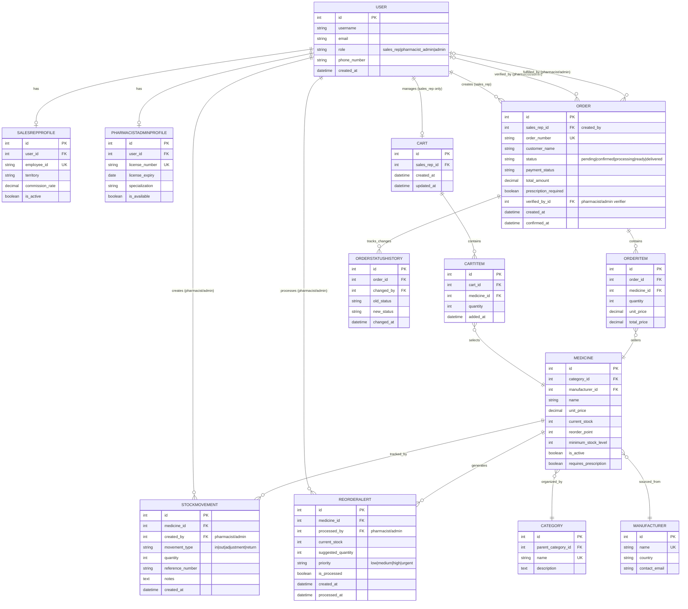

# Complete ERD: Ordering Process, Inventory & User Roles Workflow

## OnCare Medicine Ordering System - Process-Focused ERD

This ERD diagram shows the complete workflow involving:
- **Three User Roles**: Sales Representative, Pharmacist/Admin, Admin
- **Ordering Process**: Cart → Order → Order Items
- **Inventory Management**: Stock tracking, reorder alerts, stock movements

---

## Complete Mermaid ERD Code



---

## Process Flow by User Role

### 🔵 Sales Representative Process

```
1. LOGIN → USER (role: sales_rep)
   └─→ Has SALESREPPROFILE

2. BROWSE MEDICINES → MEDICINE
   └─→ Organized by CATEGORY
   └─→ From MANUFACTURER

3. ADD TO CART → CART
   └─→ Creates CARTITEM
   └─→ References MEDICINE

4. CHECKOUT → ORDER
   └─→ Converts CARTITEM to ORDERITEM
   └─→ ORDER status: "pending"

5. TRACK ORDER → ORDERSTATUSHISTORY
   └─→ Views status updates
```

### 🟢 Pharmacist/Admin Process

```
1. LOGIN → USER (role: pharmacist_admin)
   └─→ Has PHARMACISTADMINPROFILE

2. RECEIVE ORDER → ORDER (status: pending)
   └─→ Review prescription (if required)
   └─→ Set ORDER.verified_by = user

3. CHECK STOCK → MEDICINE.current_stock
   └─→ Verify availability

4. FULFILL ORDER → ORDER status: processing → ready → delivered
   └─→ Create STOCKMOVEMENT (type: "out")
   └─→ Update MEDICINE.current_stock (decrease)
   └─→ Create ORDERSTATUSHISTORY

5. MANAGE INVENTORY
   ├─→ Process REORDERALERT (when stock low)
   ├─→ Create STOCKMOVEMENT (type: "in")
   └─→ Update MEDICINE.current_stock (increase)
```

### 🟡 Admin Process

```
1. LOGIN → USER (role: admin)

2. FULL ACCESS
   ├─→ All Sales Rep functions
   ├─→ All Pharmacist/Admin functions
   └─→ System management
```

---

## Key Workflow Relationships

### Ordering Workflow

| Step | From | To | Action |
|------|------|-----|--------|
| 1 | Sales Rep | CART | Creates/manages cart |
| 2 | CART | CARTITEM | Adds medicine items |
| 3 | CARTITEM | MEDICINE | References medicine |
| 4 | Sales Rep | ORDER | Creates order from cart |
| 5 | ORDER | ORDERITEM | Contains order items |
| 6 | ORDERITEM | MEDICINE | Orders specific medicine |
| 7 | Pharmacist/Admin | ORDER | Verifies & fulfills |

### Inventory Workflow

| Step | From | To | Action |
|------|------|-----|--------|
| 1 | ORDER | MEDICINE | Checks stock availability |
| 2 | Pharmacist/Admin | STOCKMOVEMENT | Records stock change |
| 3 | STOCKMOVEMENT | MEDICINE | Updates current_stock |
| 4 | MEDICINE | REORDERALERT | Generates when stock low |
| 5 | Pharmacist/Admin | REORDERALERT | Processes & restocks |

---

## Entity Descriptions

### User Roles

- **USER**: Base user entity with role field (sales_rep, pharmacist_admin, admin)
- **SALESREPPROFILE**: Extended profile for sales representatives
- **PHARMACISTADMINPROFILE**: Extended profile for pharmacists/admins

### Ordering Entities

- **CART**: Shopping cart for sales reps (one per sales rep)
- **CARTITEM**: Items in the cart
- **ORDER**: Customer order (created from cart)
- **ORDERITEM**: Individual items in an order
- **ORDERSTATUSHISTORY**: Tracks all status changes

### Inventory Entities

- **MEDICINE**: Product catalog with stock levels
- **STOCKMOVEMENT**: Records all stock changes (in/out/adjustment)
- **REORDERALERT**: Alerts when stock needs replenishment

### Catalog Entities

- **CATEGORY**: Medicine categories for organization
- **MANUFACTURER**: Medicine suppliers/manufacturers

---

## Complete Process Sequence

```
┌─────────────────────────────────────────────────────────────┐
│                    ORDERING PROCESS                         │
└─────────────────────────────────────────────────────────────┘

Sales Rep                    Pharmacist/Admin
    │                              │
    ├─→ Browse MEDICINE            │
    ├─→ Add to CART                │
    ├─→ Create ORDER ──────────────┼─→ Receive ORDER
    │                              ├─→ Verify prescription
    │                              ├─→ Check MEDICINE stock
    │                              ├─→ Create STOCKMOVEMENT (out)
    │                              ├─→ Update ORDER status
    │                              └─→ Create ORDERSTATUSHISTORY
    │
    └─→ Track ORDER status ────────┘

┌─────────────────────────────────────────────────────────────┐
│                  INVENTORY MANAGEMENT                       │
└─────────────────────────────────────────────────────────────┘

    MEDICINE.current_stock <= reorder_point
            │
            ▼
    REORDERALERT (generated automatically)
            │
            ▼
    Pharmacist/Admin processes alert
            │
            ├─→ Create STOCKMOVEMENT (in)
            └─→ Update MEDICINE.current_stock
```

---

## Files Available

1. **ERD_COMPLETE_WORKFLOW.md** (this file) - Most comprehensive
2. **ERD_ORDERING_INVENTORY_PROCESS.md** - Detailed documentation
3. **ERD_WORKFLOW_SIMPLE.md** - Simplified version
4. **ERD_ORDERING_PROCESS.mmd** - Raw Mermaid file

---

**Copy the Mermaid code above to [Mermaid Live Editor](https://mermaid.live/) to visualize the complete workflow!**


