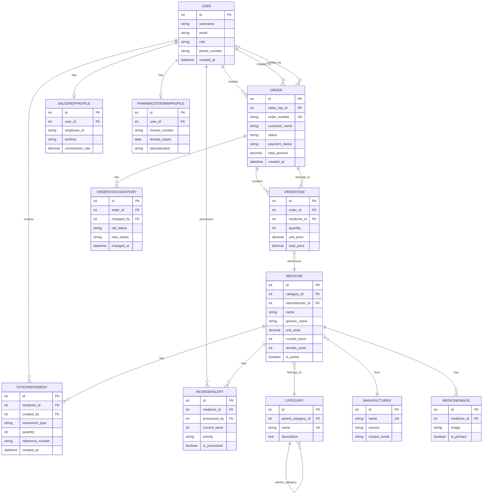
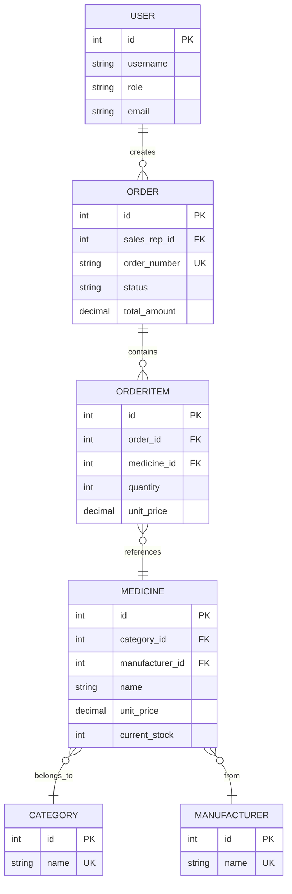

# ERD Diagram - Mermaid Format (Ready to Use)

## Complete ERD Diagram - All Tables

Copy the code below and paste it into [Mermaid Live Editor](https://mermaid.live/) or any markdown viewer that supports Mermaid:

---

## Level 0 ERD - Essential Tables Only (6 Tables)

For a simplified view showing only the core business logic:

---

## How to Use

### Method 1: Mermaid Live Editor (Recommended)
1. Go to: **https://mermaid.live/**
2. Copy the Mermaid code above
3. Paste into the editor
4. View the interactive diagram
5. Export as PNG, SVG, or PDF

### Method 2: GitHub/GitLab
- These platforms automatically render Mermaid diagrams
- Just include the code block in your markdown file

### Method 3: VS Code
1. Install extension: **"Markdown Preview Mermaid Support"**
2. Open this file in VS Code
3. Preview will show the rendered diagram

### Method 4: Documentation Platforms
- **Notion**: Supports Mermaid
- **Confluence**: With Mermaid plugin
- **Docusaurus**: Built-in support
- **GitBook**: Built-in support

---

## Relationship Notation

| Symbol | Meaning | Example |
|--------|---------|---------|
| `||--o{` | One-to-Many | One user creates many orders |
| `}o--||` | Many-to-One | Many items belong to one order |
| `||--o\|` | One-to-One | One user has one profile |
| `}o--o\|` | Many-to-One (optional) | Order may have a verifier |

---

## Key Fields Legend

- **PK** = Primary Key (unique identifier)
- **FK** = Foreign Key (reference to another table)
- **UK** = Unique Key (unique constraint)

---

## Files Available

1. **ERD_MERMAID_READY.md** (this file) - Ready-to-use code
2. **ERD_DIAGRAM_COMPLETE.mmd** - Complete ERD as .mmd file
3. **ERD_DIAGRAM_SIMPLE.mmd** - Simple Level 0 ERD as .mmd file
4. **DATABASE_ERD_MERMAID.md** - Detailed documentation

---

**Ready to use!** Copy the code above and paste it into Mermaid Live Editor to generate your diagram.

