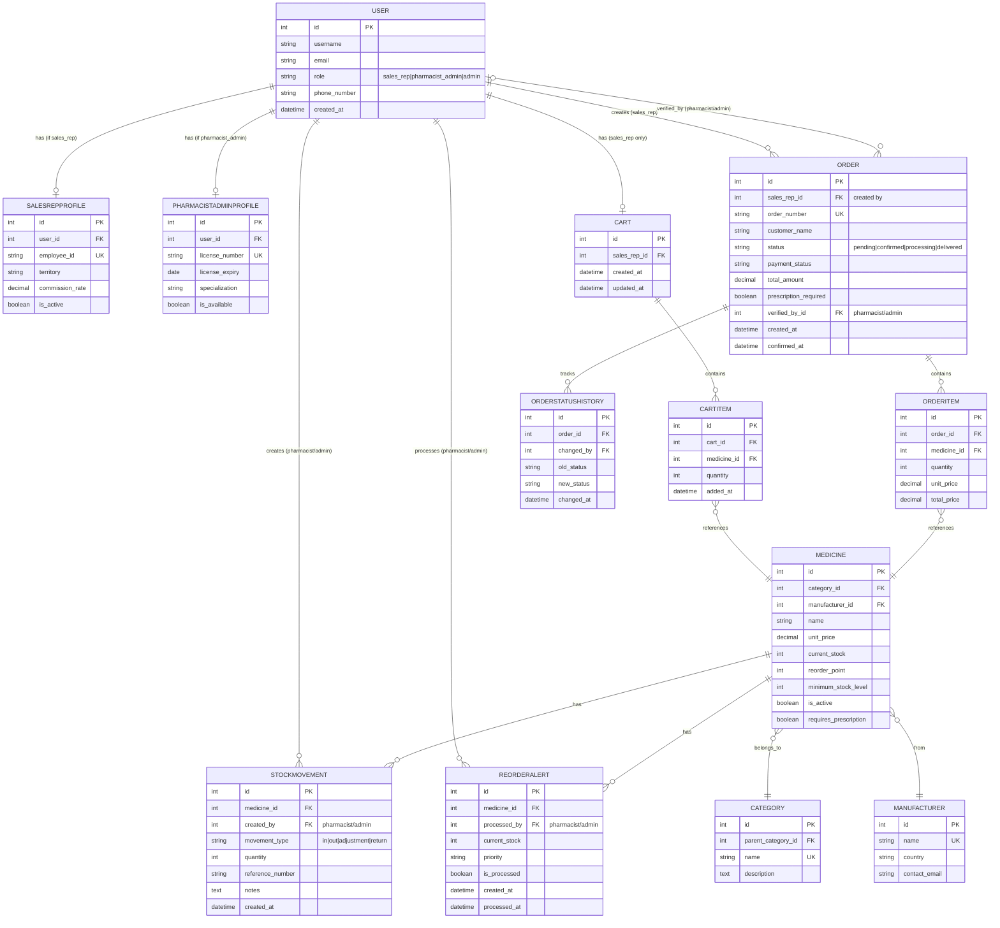

# ERD Diagram: Ordering Process & Inventory Management with User Roles

## Entity Relationship Diagram - Workflow Focused

This ERD focuses on the **ordering process**, **inventory management**, and the **three user roles** (Sales Representative, Pharmacist/Admin, and Admin) in the OnCare Medicine Ordering System.



---

## Process Flow Explanation

### 1. Sales Representative Workflow

```
Sales Rep (USER with SALESREPPROFILE)
    │
    │ (1) Browsing & Shopping
    ▼
CART (one per sales rep)
    │
    │ (2) Adding items
    ▼
CARTITEM (multiple medicines)
    │
    │ (3) Checkout → Convert to Order
    ▼
ORDER (created by sales rep)
    │
    │ (4) Order contains
    ▼
ORDERITEM (references medicines from cart)
```

### 2. Pharmacist/Admin Workflow

```
Pharmacist/Admin (USER with PHARMACISTADMINPROFILE)
    │
    ├─→ (1) Receives ORDER (status: pending)
    │   │
    │   ├─→ Verify prescription (if required)
    │   │   └─→ Updates ORDER.verified_by
    │   │
    │   ├─→ Check stock availability (MEDICINE.current_stock)
    │   │
    │   └─→ Update ORDER status (processing → ready → delivered)
    │       └─→ Creates ORDERSTATUSHISTORY
    │
    └─→ (2) Inventory Management
        │
        ├─→ Creates STOCKMOVEMENT (stock in/out/adjustment)
        │   └─→ Updates MEDICINE.current_stock
        │
        └─→ Processes REORDERALERT
            └─→ When MEDICINE.current_stock <= reorder_point
```

### 3. Admin Workflow

```
Admin (USER with role='admin')
    │
    ├─→ Can do everything Pharmacist/Admin can do
    │
    └─→ Additional system management
        └─→ User management, system configuration
```

---

## Key Relationships

### Ordering Process Relationships

1. **USER (sales_rep) → CART** (1:1)
   - Each sales rep has one shopping cart

2. **CART → CARTITEM** (1:N)
   - Cart contains multiple items

3. **CARTITEM → MEDICINE** (N:1)
   - Each cart item references a medicine

4. **USER (sales_rep) → ORDER** (1:N)
   - Sales rep creates multiple orders

5. **ORDER → ORDERITEM** (1:N)
   - Order contains multiple items

6. **ORDERITEM → MEDICINE** (N:1)
   - Order items reference medicines

7. **ORDER → USER (pharmacist/admin)** (N:1, optional)
   - Orders can be verified by pharmacist/admin

### Inventory Management Relationships

8. **USER (pharmacist/admin) → STOCKMOVEMENT** (1:N)
   - Pharmacist/admin creates stock movements

9. **MEDICINE → STOCKMOVEMENT** (1:N)
   - Medicine has many stock movements

10. **USER (pharmacist/admin) → REORDERALERT** (1:N)
    - Pharmacist/admin processes reorder alerts

11. **MEDICINE → REORDERALERT** (1:N)
    - Medicine can have multiple reorder alerts

---

## Role-Based Access Summary

| Entity | Sales Rep | Pharmacist/Admin | Admin |
|--------|-----------|------------------|-------|
| **CART** | ✅ Create/View/Update | ❌ | ❌ |
| **ORDER** | ✅ Create | ✅ View/Update/Fulfill | ✅ All |
| **MEDICINE** | ✅ View | ✅ View/Manage | ✅ All |
| **STOCKMOVEMENT** | ❌ | ✅ Create | ✅ All |
| **REORDERALERT** | ❌ | ✅ View/Process | ✅ All |
| **Prescription Verification** | ❌ | ✅ Verify | ✅ All |

---

## Workflow Sequence

### Complete Order Lifecycle

```
1. Sales Rep logs in
   └─→ Creates/views CART

2. Sales Rep adds medicines to CART
   └─→ Creates CARTITEM records

3. Sales Rep checks out
   └─→ CART converts to ORDER
   └─→ CARTITEM converts to ORDERITEM
   └─→ ORDER status: "pending"

4. Pharmacist/Admin receives ORDER
   └─→ Reviews ORDER (prescription if needed)
   └─→ Updates ORDER.verified_by
   └─→ Checks MEDICINE.current_stock

5. Pharmacist/Admin fulfills ORDER
   └─→ Updates ORDER.status: "processing"
   └─→ Creates STOCKMOVEMENT (type: "out")
   └─→ Updates MEDICINE.current_stock (decreases)
   └─→ Creates ORDERSTATUSHISTORY

6. ORDER status: "ready_for_pickup" → "delivered"
   └─→ Creates ORDERSTATUSHISTORY for each status change

7. If MEDICINE.current_stock <= reorder_point
   └─→ System creates REORDERALERT
   └─→ Pharmacist/Admin processes alert
   └─→ Creates STOCKMOVEMENT (type: "in")
   └─→ Updates MEDICINE.current_stock (increases)
```

---

## Files Available

1. **ERD_ORDERING_INVENTORY_PROCESS.md** (this file) - Complete documentation
2. **ERD_ORDERING_PROCESS.mmd** - Mermaid source file
3. Copy the Mermaid code above to view in [Mermaid Live Editor](https://mermaid.live/)

---

**This diagram shows the complete workflow of how Sales Reps create orders and how Pharmacist/Admin manages inventory and fulfills orders.**


