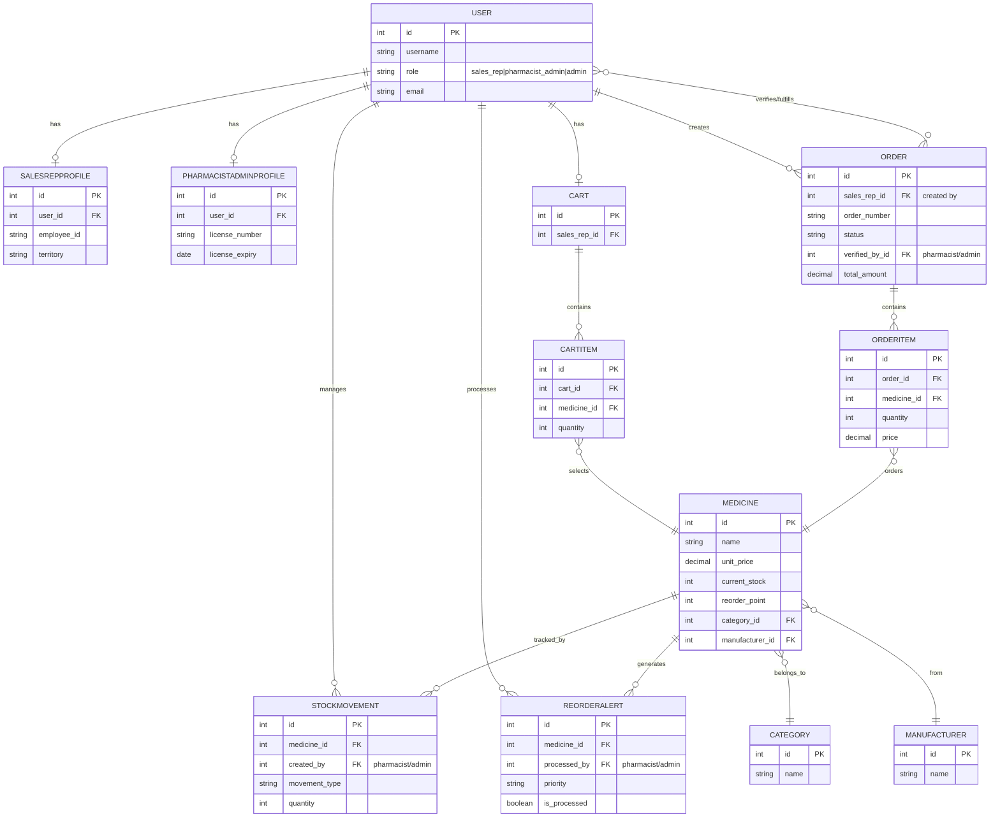

# ERD: Ordering & Inventory Workflow (Simple Version)

## Focus: Ordering Process, Inventory Management, and User Roles

Simplified ERD showing the essential workflow between the three user roles.



---

## Process Flow Visualization

```
┌─────────────────────────────────────────────────────────────────┐
│                    SALES REPRESENTATIVE                         │
│                    (Ordering Process)                           │
└─────────────────────────────────────────────────────────────────┘

    USER (sales_rep)
         │
         ├─→ CART (shopping cart)
         │    │
         │    └─→ CARTITEM → MEDICINE
         │
         └─→ ORDER (checkout)
              │
              └─→ ORDERITEM → MEDICINE


┌─────────────────────────────────────────────────────────────────┐
│                  PHARMACIST/ADMIN                               │
│              (Inventory Management & Order Fulfillment)          │
└─────────────────────────────────────────────────────────────────┘

    USER (pharmacist_admin)
         │
         ├─→ ORDER (verify & fulfill)
         │    │
         │    └─→ Updates status, verifies prescription
         │
         └─→ MEDICINE (inventory management)
              │
              ├─→ STOCKMOVEMENT (track stock changes)
              │
              └─→ REORDERALERT (manage low stock)


┌─────────────────────────────────────────────────────────────────┐
│                         MEDICINE CATALOG                        │
└─────────────────────────────────────────────────────────────────┘

    MEDICINE
         │
         ├─→ CATEGORY (organization)
         │
         └─→ MANUFACTURER (source)
```

---

## User Role Responsibilities

### 👤 Sales Representative
- **CART Management**: Add/remove medicines to cart
- **ORDER Creation**: Create orders from cart
- **Order Tracking**: View order status

### 👨‍⚕️ Pharmacist/Admin
- **Inventory Management**: 
  - Create STOCKMOVEMENT records
  - Process REORDERALERT
  - Update MEDICINE stock levels
- **Order Fulfillment**:
  - Verify orders (prescription verification)
  - Update ORDER status
  - Track order progress

### 👑 Admin
- **All Permissions**: Can do everything above
- **System Management**: User management, configuration

---

## Key Relationships Explained

### Ordering Flow
1. **Sales Rep** has **CART** → contains **CARTITEM** → references **MEDICINE**
2. **Sales Rep** creates **ORDER** → contains **ORDERITEM** → references **MEDICINE**
3. **Pharmacist/Admin** verifies/fulfills **ORDER**

### Inventory Flow
1. **MEDICINE** stock tracked by **STOCKMOVEMENT**
2. **MEDICINE** generates **REORDERALERT** when stock low
3. **Pharmacist/Admin** creates **STOCKMOVEMENT** and processes **REORDERALERT**

---

**Copy the Mermaid code above and paste it into [Mermaid Live Editor](https://mermaid.live/) to view the diagram!**


