# Medicine Ordering System - Complete Documentation

## Table of Contents
1. [System Overview](#system-overview)
2. [User Roles and Functions](#user-roles-and-functions)
3. [Use Case Diagrams](#use-case-diagrams)
4. [System Architecture](#system-architecture)
5. [Process Flowcharts](#process-flowcharts)
6. [System Flow Description](#system-flow-description)
7. [Database Models](#database-models)
8. [Technical Implementation](#technical-implementation)

---

## System Overview

The Medicine Ordering System is a comprehensive pharmaceutical supply chain management platform that coordinates three distinct user roles through a unified workflow. The system begins with user authentication, where each user is directed to their specialized interface based on their role and responsibilities within the pharmaceutical operations.

### User Roles
- **Sales Representative**: Customer-facing role managing orders and customer relationships
- **Pharmacist/Admin**: Core operational role handling inventory management and order fulfillment
- **System Administrator**: Infrastructure management and system oversight

---

## User Roles and Functions

### Sales Representative (17 Functions)
**Order Management Capabilities:**
- Create New Order
- View Order List
- View Order Details
- Edit Order
- Cancel Order
- View Order Status

**Prescription Management:**
- Upload Prescription
- Verify Prescription

**Cart Management:**
- View Cart
- Add to Cart
- Remove from Cart
- Update Cart
- Clear Cart

**Dashboard and Reporting:**
- View Sales Dashboard
- View Order History

**Account Management:**
- Login to System
- Update Profile

### Pharmacist/Admin (28 Functions)
**Inventory Management:**
- View Inventory Dashboard
- View Medicine List
- Create Medicine
- Edit Medicine
- Delete Medicine
- View Low Stock Medicines

**Category Management:**
- View Categories
- Create Category
- Edit Category

**Stock Management:**
- View Stock Movements
- Create Stock Movement
- View Reorder Alerts

**Manufacturer Management:**
- View Manufacturers
- Create Manufacturer
- Edit Manufacturer
- Delete Manufacturer

**Order Fulfillment:**
- View All Orders
- View Order Fulfillment Dashboard
- Update Order Status

**Analytics & Forecasting:**
- View Analytics Dashboard
- Generate Demand Forecasts
- View ARIMA Analysis
- View Model Evaluation
- View Forecast Only
- View ARIMA Demonstration
- View ARIMA Step Analysis

**Account Management:**
- Login to System
- Update Profile

### System Administrator (20 Functions)
**System Monitoring:**
- View Admin Dashboard
- View System Health
- View System Metrics

**Maintenance Management:**
- View Maintenance List
- Create Maintenance
- View Maintenance Details

**Report Management:**
- View Reports
- Create Report
- View Report Details
- Execute Report

**Dashboard Widgets:**
- View Widgets
- Create Widget
- Edit Widget

**Alert Management:**
- View Alerts
- View Alert Details
- Acknowledge Alert
- Resolve Alert

**User Activity:**
- View User Activity

**Account Management:**
- Login to System
- Update Profile

---

## Use Case Diagrams

### Sales Representative - Complete Use Case Diagram


### Pharmacist/Admin - Complete Use Case Diagram


### System Administrator - Complete Use Case Diagram


---

## System Architecture

### C4 Context Diagram


### System Architecture Diagram

```mermaid
architecture-beta
    group apps[Application Modules]
    group arima[ARIMA Forecasting]
    group data[Data Layer]

    service accounts(accounts)[Accounts App] in apps
    service analytics(analytics)[Analytics App] in apps
    service audits(audits)[Audits App] in apps
    service common(common)[Common App] in apps
    service inventory(inventory)[Inventory App] in apps
    service logs(logs)[Logs App] in apps
    service oncare_admin_app(admin)[OnCare Admin App] in apps
    service orders(orders)[Orders App] in apps
    service transactions(transactions)[Transactions App] in apps

    service data_collection(server)[Data Collection] in arima
    service preprocessing(server)[Data Preprocessing] in arima
    service model_training(server)[Model Training] in arima
    service forecasting(server)[Forecast Generation] in arima

    service sqlite_db(database)[SQLite Database] in data
    service redis_cache(disk)[Redis Cache] in data

    analytics:B -- T:data_collection
    analytics:B -- T:preprocessing
    analytics:B -- T:model_training
    analytics:B -- T:forecasting

    accounts:B -- T:sqlite_db
    analytics:B -- T:sqlite_db
    audits:B -- T:sqlite_db
    common:B -- T:sqlite_db
    inventory:B -- T:sqlite_db
    logs:B -- T:sqlite_db
    oncare_admin_app:B -- T:sqlite_db
    orders:B -- T:sqlite_db
    transactions:B -- T:sqlite_db

    data_collection:B -- T:sqlite_db
    preprocessing:B -- T:sqlite_db
    model_training:B -- T:sqlite_db
    forecasting:B -- T:sqlite_db

    redis_cache:T -- B:sqlite_db
    analytics:R -- L:redis_cache
    inventory:R -- L:redis_cache
    orders:R -- L:redis_cache
```



---

## Process Flowcharts

### Ordering Process Flowchart


### ARIMA Forecasting Process Flowchart


### Combined System Overview


---

## System Flow Description

The Medicine Ordering System operates as an integrated pharmaceutical supply chain management platform that coordinates three distinct user roles through a unified workflow. The system begins with user authentication, where each user is directed to their specialized interface based on their role and responsibilities within the pharmaceutical operations.

**Sales Representatives** serve as the primary customer interface, managing the complete order lifecycle from initial customer contact to order submission. They can create comprehensive orders for customers, selecting up to five different medicines per transaction, and managing a sophisticated shopping cart system that allows for flexible order building. The cart management functionality includes adding and removing items, updating quantities, and clearing the entire cart when necessary. Once the order is complete, sales representatives process payments and submit orders to the fulfillment system, initiating the transition from sales to operational processing.

**Pharmacist/Admin users** handle the core pharmaceutical operations, combining inventory management with advanced analytics capabilities. They manage the complete medicine catalog, including creating new medicine entries, updating existing records, and maintaining accurate inventory levels. The system provides sophisticated stock management tools that track all inventory movements, monitor reorder points, and generate alerts when stock levels fall below optimal thresholds. Additionally, these users have access to advanced ARIMA forecasting capabilities that analyze historical sales data to generate accurate demand predictions, enabling proactive inventory planning and optimization.

**System Administrators** maintain overall system health and operational oversight, focusing on infrastructure management and performance monitoring. They can access comprehensive system health metrics, generate detailed operational reports, and monitor user activity across all system modules. The system provides real-time monitoring capabilities that track performance metrics, identify potential issues, and generate alerts when maintenance or attention is required.

The system's integration points ensure seamless data flow between all operational areas. Order fulfillment connects the sales process with inventory management, ensuring that orders are processed only when adequate stock is available and that inventory levels are updated in real-time upon order completion. The forecasting system integrates with inventory planning, providing data-driven insights that inform purchasing decisions and optimize stock levels. System monitoring maintains overall platform health, ensuring reliable operation and supporting maintenance scheduling.

**Process completion** is achieved through multiple pathways: orders progress from creation to successful delivery, inventory levels are updated in real-time to reflect all transactions, planning systems are continuously updated with forecast data, and system health is monitored continuously to ensure optimal performance. This integrated approach creates a comprehensive pharmaceutical supply chain management solution that combines operational efficiency with strategic planning capabilities, supporting both day-to-day operations and long-term business growth through advanced analytics and automated workflows.

The system's modular design allows each user role to focus on their specific responsibilities while maintaining seamless integration with other system components. Real-time data synchronization ensures consistency across all modules, while role-based security maintains appropriate access levels and data protection. The combination of automated workflows, predictive analytics, and comprehensive monitoring creates an efficient, scalable platform that supports the complex requirements of modern pharmaceutical supply chain management while reducing manual intervention and improving overall operational accuracy.

---

## Database Models

### Core Models

#### User Model (accounts/models.py)
- **Role-based access control** with three user types: Sales Rep, Pharmacist/Admin, Admin
- **Profile management** with contact information and preferences
- **Permission properties** for role-based functionality access

#### Medicine Model (inventory/models.py)
- **Comprehensive medicine catalog** with detailed pharmaceutical information
- **Inventory tracking** with current stock, reorder points, and stock status
- **Regulatory compliance** with NDC numbers and FDA approval dates
- **Stock status properties** for low stock and out-of-stock detection

#### StockMovement Model (inventory/models.py)
- **Complete audit trail** of all inventory movements
- **Movement types**: in, out, adjustment, return, damage, expired
- **Reference tracking** for purchase orders and invoices
- **User attribution** for accountability

#### Order Model (orders/models.py)
- **Order lifecycle management** with status tracking
- **Customer information** and delivery details
- **Payment processing** integration
- **Prescription handling** for controlled substances

#### DemandForecast Model (analytics/models.py)
- **ARIMA forecasting results** storage
- **Model evaluation metrics** (RMSE, MAE, MAPE)
- **Confidence intervals** for forecast accuracy
- **Time series data** for historical analysis

### Model Relationships

```
User (1) ←→ (Many) Order
User (1) ←→ (Many) StockMovement
Medicine (1) ←→ (Many) OrderItem
Medicine (1) ←→ (Many) StockMovement
Medicine (1) ←→ (Many) DemandForecast
Order (1) ←→ (Many) OrderItem
Order (1) ←→ (Many) OrderStatusHistory
```

---

## Technical Implementation

### Technology Stack
- **Backend**: Django 5.2.6 (Python 3.13)
- **Database**: SQLite3 (development) / MySQL (production ready)
- **Frontend**: Bootstrap 5, Chart.js, jQuery
- **Analytics**: Pandas, NumPy, Statsmodels, PMDARIMA, Scikit-learn
- **Additional**: Django REST Framework, Celery, Redis

### Key Features
1. **Multi-role Collaboration**: Seamless handoffs between different user types
2. **Real-time Updates**: Instant data synchronization across all modules
3. **Predictive Analytics**: ARIMA forecasting for proactive inventory management
4. **Automated Workflows**: Reduced manual processing and human error
5. **Comprehensive Monitoring**: System-wide health and performance tracking
6. **Data-driven Decisions**: Analytics-driven inventory and operational planning

### ARIMA Forecasting Implementation
- **6-Step Process**: Stationarity → Decomposition → Model Selection → Training → Forecasting → Evaluation
- **Automated Model Selection**: Auto ARIMA with parameter optimization
- **Quality Checks**: Data sufficiency and model accuracy validation
- **Visualization**: Charts and graphs for each step
- **Integration**: Direct connection to inventory planning
- **Error Handling**: Comprehensive error management and user guidance

### Security Features
- **Role-based Access Control**: Each user type has appropriate permissions
- **Data Validation**: Comprehensive input validation and sanitization
- **Audit Trails**: Complete tracking of all system activities
- **Secure Authentication**: Django's built-in authentication system
- **Data Protection**: Proper handling of sensitive pharmaceutical data

---

## Conclusion

The Medicine Ordering System represents a comprehensive solution for pharmaceutical supply chain management, combining operational efficiency with advanced analytics capabilities. The system's modular architecture, role-based access control, and integrated forecasting capabilities create a robust platform that supports both day-to-day operations and strategic planning while maintaining regulatory compliance and data security.

The implementation of ARIMA forecasting provides valuable insights for inventory optimization, while the streamlined ordering process ensures efficient customer service. The system's comprehensive monitoring and reporting capabilities enable data-driven decision making and support continuous improvement of pharmaceutical operations.

This documentation provides a complete overview of the system's functionality, architecture, and implementation details, serving as a comprehensive reference for users, developers, and stakeholders involved in the Medicine Ordering System.
