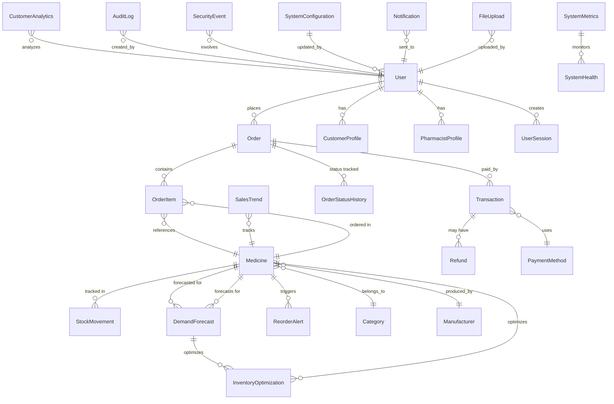
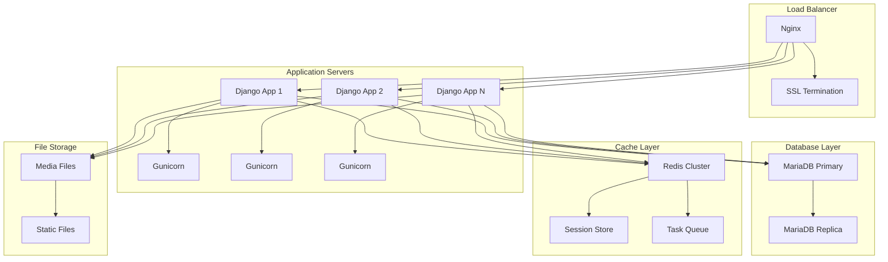

# OnCare Medicine Ordering System - Architecture Overview

## System Architecture Diagram

```mermaid
graph TB
    subgraph "Frontend Layer"
        A[Web Browser] --> B[Bootstrap 5 UI]
        B --> C[Chart.js Visualizations]
        C --> D[Responsive Templates]
    end
    
    subgraph "Django MTV Layer"
        E[Django Views] --> F[URL Routing]
        F --> G[Templates Engine]
        G --> H[Static Files]
        
        I[Models Layer] --> J[Database ORM]
        J --> K[Model Relationships]
    end
    
    subgraph "Application Modules"
        L[Accounts App] --> M[User Management]
        M --> N[Authentication]
        N --> O[Role-based Access]
        
        P[Inventory App] --> Q[Medicine Catalog]
        Q --> R[Stock Management]
        R --> S[Reorder Alerts]
        
        T[Orders App] --> U[Order Processing]
        U --> V[Cart Management]
        V --> W[Prescription Handling]
        
        X[Analytics App] --> Y[ARIMA Forecasting]
        Y --> Z[Demand Prediction]
        Z --> AA[Supply Chain Optimization]
        
        BB[Transactions App] --> CC[Payment Processing]
        CC --> DD[Financial Reports]
        
        EE[Audits App] --> FF[Activity Logging]
        FF --> GG[Security Monitoring]
        GG --> HH[Compliance Tracking]
        
        II[OnCare Admin App] --> JJ[Dashboard Management]
        JJ --> KK[System Monitoring]
        KK --> LL[Report Generation]
        
        MM[Common App] --> NN[Shared Utilities]
        NN --> OO[Notifications]
        OO --> PP[File Management]
    end
    
    subgraph "Data Layer"
        QQ[MariaDB Database] --> RR[User Data]
        QQ --> SS[Medicine Inventory]
        QQ --> TT[Order History]
        QQ --> UU[Transaction Records]
        QQ --> VV[Analytics Data]
        QQ --> WW[Audit Logs]
    end
    
    subgraph "External Services"
        XX[Redis Cache] --> YY[Session Storage]
        XX --> ZZ[Task Queue]
        
        AAA[Email Service] --> BBB[Notifications]
        AAA --> CCC[Reports]
        
        DDD[File Storage] --> EEE[Prescriptions]
        DDD --> FFF[Documents]
    end
    
    subgraph "Analytics Engine"
        GGG[ARIMA Service] --> HHH[Time Series Analysis]
        HHH --> III[Demand Forecasting]
        III --> JJJ[Inventory Optimization]
        JJJ --> KKK[Cost Analysis]
        
        LLL[Data Visualization] --> MMM[Chart.js]
        MMM --> NNN[Interactive Dashboards]
    end
    
    A --> E
    E --> I
    I --> QQ
    L --> QQ
    P --> QQ
    T --> QQ
    X --> QQ
    BB --> QQ
    EE --> QQ
    II --> QQ
    MM --> QQ
    
    X --> GGG
    GGG --> LLL
    LLL --> A
    
    E --> XX
    E --> AAA
    E --> DDD
```



## Database Schema (ERD)



## Technology Stack

### Frontend
- **HTML5/CSS3**: Semantic markup and styling
- **Bootstrap 5**: Responsive UI framework
- **JavaScript/jQuery**: Interactive functionality
- **Chart.js**: Data visualization
- **Font Awesome**: Icons

### Backend
- **Django 4.2**: Web framework (MTV pattern)
- **Python 3.8+**: Programming language
- **Django REST Framework**: API development
- **Celery**: Asynchronous task processing
- **Redis**: Caching and message broker

### Database
- **MariaDB**: Primary database
- **Django ORM**: Database abstraction

### Analytics & ML
- **Pandas**: Data manipulation
- **NumPy**: Numerical computing
- **Scikit-learn**: Machine learning utilities
- **Statsmodels**: Statistical modeling
- **PMDARIMA**: Auto ARIMA implementation
- **Matplotlib/Seaborn**: Data visualization
- **Plotly**: Interactive charts

### Security & Monitoring
- **Django Security**: Built-in security features
- **Audit Logging**: Comprehensive activity tracking
- **Session Management**: Secure user sessions
- **Role-based Access Control**: Multi-level permissions

## System Flow

### 1. User Authentication Flow
```
User Login → Authentication → Role Assignment → Dashboard Redirect
```

### 2. Order Processing Flow
```
Medicine Selection → Cart Management → Prescription Upload → Order Confirmation → Payment → Fulfillment
```

### 3. Analytics Flow
```
Data Collection → ARIMA Analysis → Demand Forecasting → Inventory Optimization → Reorder Alerts
```

### 4. Supply Chain Optimization Flow
```
Historical Sales Data → Time Series Analysis → ARIMA Model → Demand Forecast → EOQ Calculation → Reorder Points
```

## Quality Attributes

### Performance
- Database indexing for fast queries
- Redis caching for session management
- Asynchronous task processing with Celery
- Optimized database queries with select_related/prefetch_related

### Scalability
- Modular Django app architecture
- Horizontal scaling with load balancers
- Database sharding capabilities
- Microservices-ready design

### Security
- HTTPS enforcement
- SQL injection prevention
- XSS protection
- CSRF tokens
- Role-based access control
- Audit logging

### Maintainability
- Clean code architecture
- Comprehensive documentation
- Unit testing framework
- Code review processes
- Version control with Git

### Reliability
- Database transactions
- Error handling and logging
- Backup and recovery procedures
- Health monitoring
- Graceful degradation

## Deployment Architecture



## API Endpoints Structure

### Authentication
- `POST /accounts/login/` - User login
- `POST /accounts/logout/` - User logout
- `POST /accounts/register/` - User registration

### Inventory Management
- `GET /inventory/api/medicines/` - List medicines
- `POST /inventory/api/stock-movements/` - Add stock movement
- `GET /inventory/api/reorder-alerts/` - Get reorder alerts

### Order Management
- `GET /orders/api/orders/` - List orders
- `POST /orders/api/cart/add/` - Add to cart
- `POST /orders/api/orders/create/` - Create order

### Analytics
- `POST /analytics/api/forecast/generate/` - Generate forecast
- `GET /analytics/api/sales-trends/{id}/` - Get sales trends
- `GET /analytics/api/inventory-optimization/{id}/` - Get optimization

### Transactions
- `GET /transactions/api/transactions/` - List transactions
- `POST /transactions/api/refund/` - Process refund

### Admin
- `GET /oncare-admin/api/dashboard-data/` - Dashboard data
- `GET /oncare-admin/api/system-metrics/` - System metrics

## Security Considerations

1. **Authentication & Authorization**
   - Multi-factor authentication support
   - Role-based access control
   - Session management with Redis

2. **Data Protection**
   - Encryption at rest and in transit
   - PII data anonymization
   - GDPR compliance features

3. **Audit & Compliance**
   - Comprehensive audit logging
   - HIPAA compliance features
   - Data retention policies

4. **Network Security**
   - HTTPS enforcement
   - CORS configuration
   - Rate limiting

This architecture provides a robust, scalable, and secure foundation for the OnCare Medicine Ordering System with advanced analytics capabilities.


