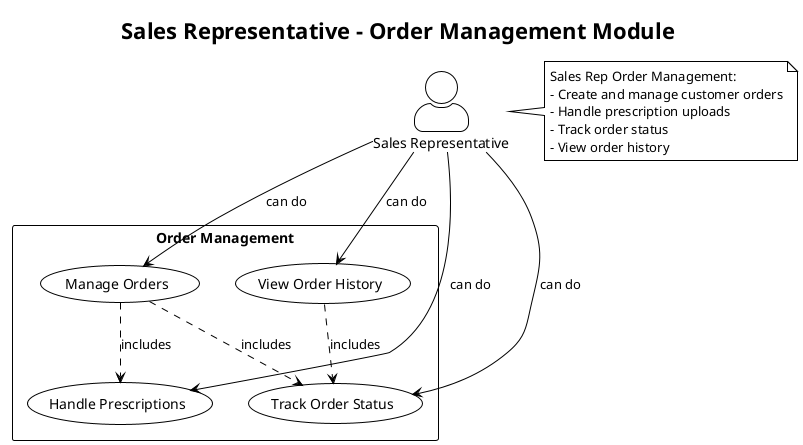
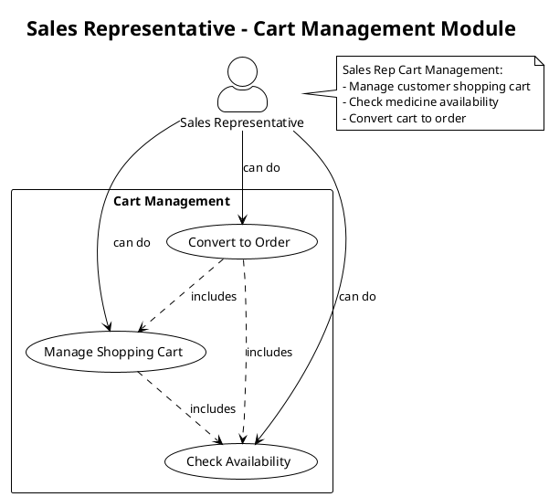
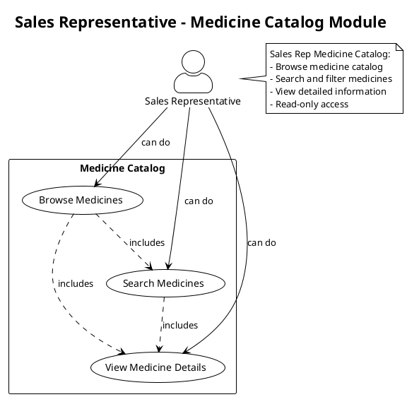
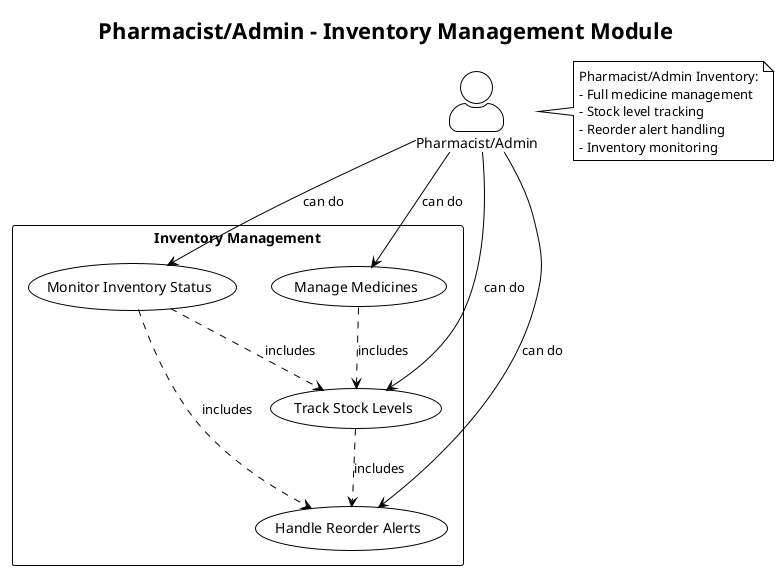
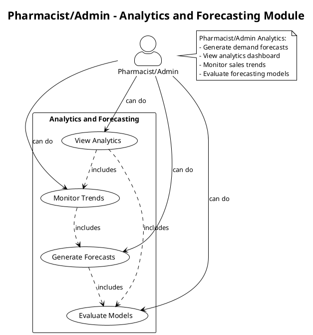
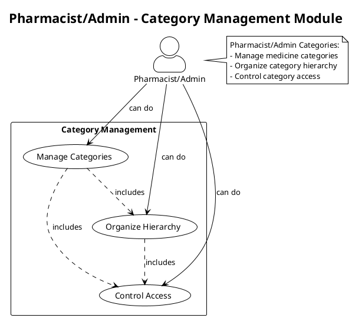
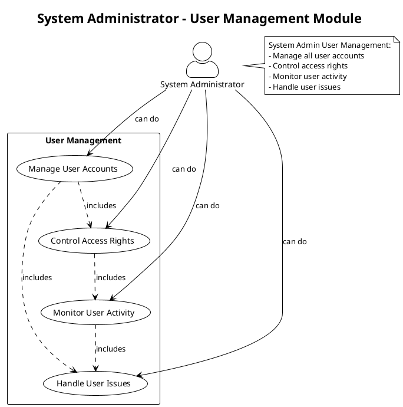
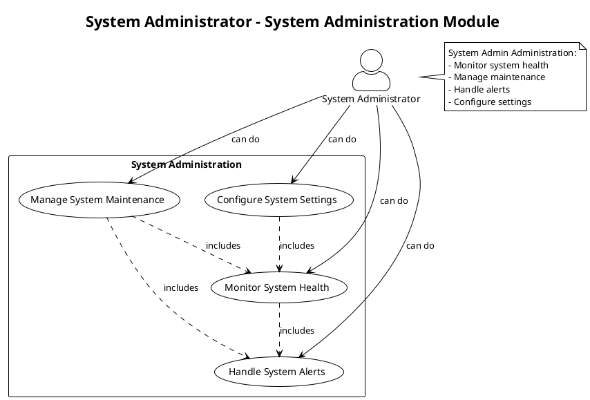
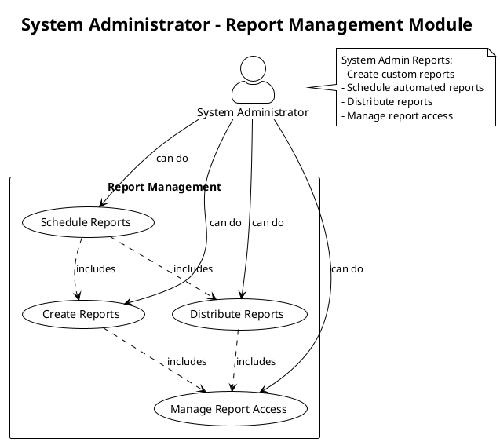

# UML Use Case Diagrams Per Module - OnCare Medicine Ordering System

This document contains UML use case diagrams organized by user role and module, showing the general capabilities of each user type within specific functional areas.

## Table of Contents
1. [Sales Representative Modules](#sales-representative-modules)
2. [Pharmacist/Admin Modules](#pharmacistadmin-modules)
3. [System Administrator Modules](#system-administrator-modules)

---

## Sales Representative Modules

### 1.1 Order Management Module - Sales Representative

### 1.2 Cart Management Module - Sales Representative

### 1.3 Medicine Catalog Module - Sales Representative

---

## Pharmacist/Admin Modules

### 2.1 Inventory Management Module - Pharmacist/Admin

### 2.2 Analytics and Forecasting Module - Pharmacist/Admin

### 2.3 Category Management Module - Pharmacist/Admin

---

## System Administrator Modules

### 3.1 User Management Module - System Administrator

### 3.2 System Administration Module - System Administrator

### 3.3 Report Management Module - System Administrator

---

## Summary

### Sales Representative Modules (3 modules, 10 total use cases):
1. **Order Management** (4 use cases) - Order management, prescription handling, status tracking
2. **Cart Management** (3 use cases) - Cart management, availability checking, order conversion
3. **Medicine Catalog** (3 use cases) - Browsing, searching, viewing medicine details

### Pharmacist/Admin Modules (3 modules, 11 total use cases):
1. **Inventory Management** (4 use cases) - Medicine management, stock tracking, reorder alerts
2. **Analytics and Forecasting** (4 use cases) - Forecast generation, analytics viewing, trend monitoring
3. **Category Management** (3 use cases) - Category management, hierarchy organization, access control

### System Administrator Modules (3 modules, 12 total use cases):
1. **User Management** (4 use cases) - Account management, access control, activity monitoring
2. **System Administration** (4 use cases) - Health monitoring, maintenance, alert handling, configuration
3. **Report Management** (4 use cases) - Report creation, scheduling, distribution, access management

## Usage Instructions

1. Copy any PlantUML code block into a PlantUML editor
2. Render the diagram to visualize the use cases
3. Use these diagrams for system documentation and requirement analysis
4. Each diagram shows the general capabilities within specific modules for each user role

## Key Features

- **Role-based Access Control**: Each diagram shows what each user role can do within specific modules
- **General Functionality**: Focuses on core capabilities rather than detailed operations
- **Modular Organization**: Separates functionality by system modules
- **Clear Relationships**: Shows include relationships between use cases
- **Comprehensive Coverage**: Covers all major functional areas of the system
